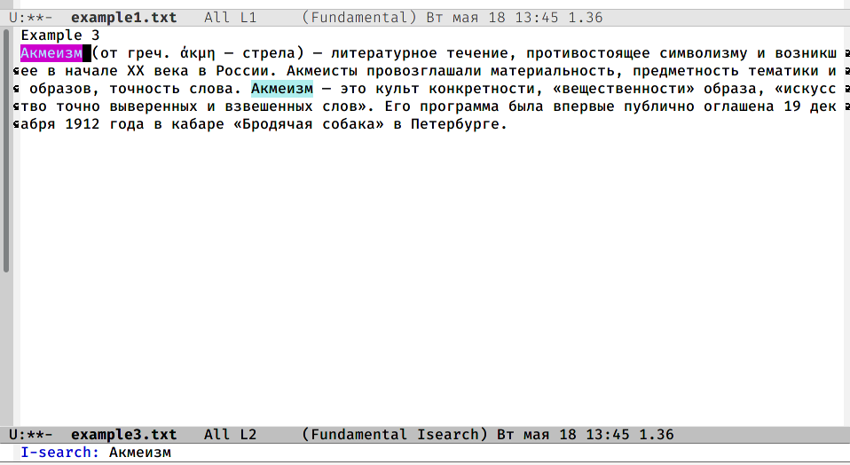

---
## Front matter
lang: ru-RU
title: Лабораторная работа №10
author: |
	Пермякова Елизавета Евгеньевна\inst{1}
institute: |
	\inst{1}RUDN University, Moscow, Russian Federation
date: 18 мая, 2021, Москва, Россия

## Formatting
toc: false
slide_level: 2
theme: metropolis
header-includes: 
 - \metroset{progressbar=frametitle,sectionpage=progressbar,numbering=fraction}
 - '\makeatletter'
 - '\beamer@ignorenonframefalse'
 - '\makeatother'
aspectratio: 43
section-titles: true
---

## Цель работы

Познакомиться с операционной системой Linux. Получить практические навыки работы с редактором Emacs.

## Задачи

1. Познакомиться с текстовым редактором emacs.
2. Изучить команды управления (для перемещения курсора, работы с текстом, работы с выделенной областью текста, для поиска и замены).
3. В ходе работы использовать эти команды и интерпретировать их вывод.
4. Выполнить отчет.

## Выполнение лабораторной работы

Открываем emacs, создаем файл с помощью комбинации клавиш. Набираем текст, который так же сохраняем с помощью определенной комбинации клавиш. Проделываем стандартные процедуры редактирования с помощью комбинаций клавиш (вырезать, вставить, скопировать, выделить текст). (рис. -@fig:001) 

{ #fig:001 width=70% }

## Выполнение лабораторной работы

Используем команды по перемещению курсора. Работаем с активными буферами и окнами. (рис. -@fig:002)

{ #fig:002 width=70% }

## Выполнение лабораторной работы

Изучаем режимы поиска ("C-s", "M-%", "M-s o"). (рис. -@fig:003)

{ #fig:003 width=70% }

## Вывод

В ходе выполнения данной лабораторной работы я познакомилась с операционной системой Linux и получила практические навыки работы с редактором Emacs.
