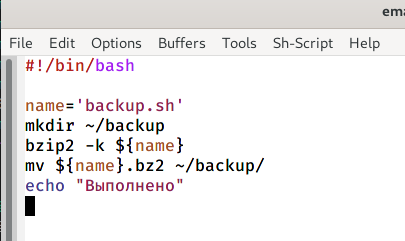
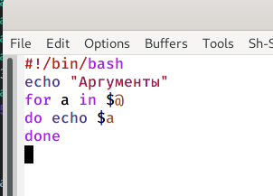
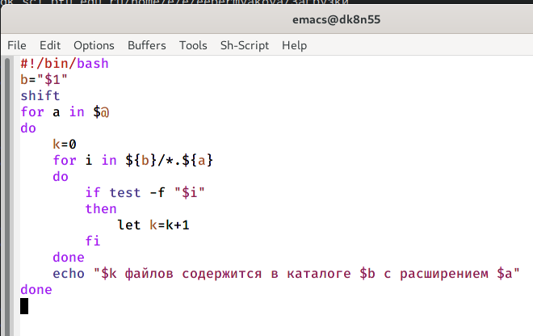

---
## Front matter
lang: ru-RU
title: Лабораторная работа №11
author: |
	Пермякова Елизавета Евгеньевна\inst{1}
institute: |
	\inst{1}RUDN University, Moscow, Russian Federation
date: 25 мая, 2021, Москва, Россия

## Formatting
toc: false
slide_level: 2
theme: metropolis
header-includes: 
 - \metroset{progressbar=frametitle,sectionpage=progressbar,numbering=fraction}
 - '\makeatletter'
 - '\beamer@ignorenonframefalse'
 - '\makeatother'
aspectratio: 43
section-titles: true
---

## Цель работы

Изучить  основы  программирования  в  оболочке  ОС UNIX/Linux. Научиться писать небольшие командные файлы.

## Задачи

1. Познакомиться с командными процессорами.
2. Изучить переменные, арифметические операторы в языке прграммирования bash.
3. Изучить операторы цикла for, while и until, оператор выбора case, условный оператор if.
4. В ходе работы написать 4 скрипта.
5. Выполнить отчет.

## Выполнение лабораторной работы

Предварительно создаем файл и открываем emacs. Пишем скрипт, который при запуске будет делать резервную копию самого себя в другую директорию backup. Файл должен архивироваться одним из архиваторов. (рис. -@fig:001) 

{ #fig:001 width=70% }

## Выполнение лабораторной работы

Пишем скрипт, обрабатывающий любое произвольное число аргументов командной строки. (рис. -@fig:002)

{ #fig:002 width=70% }

## Выполнение лабораторной работы

Пишем скрипт, являющийся аналогом команды ls. Последний скрипт получает в качестве аргумента командной строки формат файла и вычисляет количество таких файлов. (рис. -@fig:003)

{ #fig:003 width=70% }

## Вывод

В ходе выполнения данной лабораторной работы я изучила основы программирования  в  оболочке  ОС UNIX/Linux и  научилась писать небольшие командные файлы.
