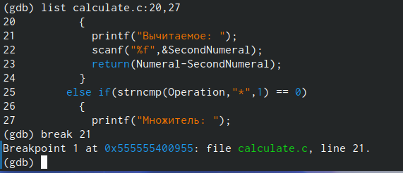
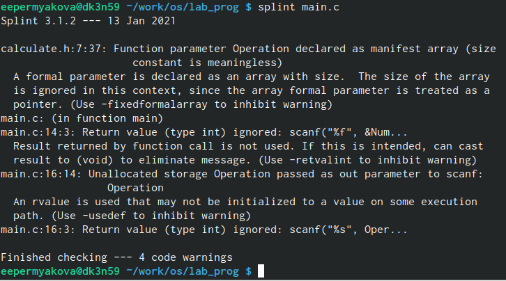

---
## Front matter
lang: ru-RU
title: Лабораторная работа №14
author: |
	Пермякова Елизавета Евгеньевна\inst{1}
institute: |
	\inst{1}RUDN University, Moscow, Russian Federation
date: 2 июня, 2021, Москва, Россия

## Formatting
toc: false
slide_level: 2
theme: metropolis
header-includes: 
 - \metroset{progressbar=frametitle,sectionpage=progressbar,numbering=fraction}
 - '\makeatletter'
 - '\beamer@ignorenonframefalse'
 - '\makeatother'
aspectratio: 43
section-titles: true
---

## Цель работы

Приобрести  простейшие  навыки  разработки,  анализа, тестирования и отладки приложений в ОС типа UNIX/Linux на примере создания  на  языке  программирования  С  калькулятора  с  простейшими функциями.

## Задачи

1. Познакомиться со стандартным средством для компиляции программ в ОС типа UNIX - GCC (GNU Compiler Collection). 
2. Познакомиться с отладчиком GDB (GNU Debugger).
3. Познакомиться с утилитой splint.
4. В ходе работы проанализировать и выполнить данные программы.
5. Выполнить отчет.

## Выполнение лабораторной работы

В ходе работы мы создали каталог, а в нем 3 файла: calculate.h, calculate.c, main.c. Это примитивнейший калькулятор, способный складывать, вычитать,умножать и делить, возводить число в степень, брать квадратный корень, вычислять sin, cos, tan. Мы выполнили компиляцию программы посредством gcc. (рис. -@fig:001) 

{ #fig:001 width=70% }

## Выполнение лабораторной работы

Мы создали Makefile. С помощью gdb выполнили отладку программы calcul. (рис. -@fig:002)

{ #fig:002 width=70% }

## Выполнение лабораторной работы

С помощью утилиты splint проанализировали коды файлов calculate.c и main.c. (рис. -@fig:003)

{ #fig:003 width=70% }

## Вывод

В  ходе  выполнения  данной  лабораторной  работы  я  приобрела простейшие  навыки  разработки,  анализа,  тестирования  и  отладки приложений  в  ОС  типа UNIX/Linux на  примере  создания  на  языке программирования С калькулятора с простейшими функциями.

