---
# Front matter
lang: ru-RU
title: "Отчёт по лабораторной работе"
subtitle: "Дисциплина: операционные системы"
author: "Пермякова Елизавета Евгеньевна"

# Formatting
toc-title: "Содержание"
toc: true # Table of contents
toc_depth: 2
lof: true # List of figures
fontsize: 12pt
linestretch: 1.5
papersize: a4paper
documentclass: scrreprt
polyglossia-lang: russian
polyglossia-otherlangs: english
mainfont: PT Serif
romanfont: PT Serif
sansfont: PT Sans
monofont: PT Mono
mainfontoptions: Ligatures=TeX
romanfontoptions: Ligatures=TeX
sansfontoptions: Ligatures=TeX,Scale=MatchLowercase
monofontoptions: Scale=MatchLowercase
indent: true
pdf-engine: lualatex
header-includes:
  - \linepenalty=10 # the penalty added to the badness of each line within a paragraph (no associated penalty node) Increasing the value makes tex try to have fewer lines in the paragraph.
  - \interlinepenalty=0 # value of the penalty (node) added after each line of a paragraph.
  - \hyphenpenalty=50 # the penalty for line breaking at an automatically inserted hyphen
  - \exhyphenpenalty=50 # the penalty for line breaking at an explicit hyphen
  - \binoppenalty=700 # the penalty for breaking a line at a binary operator
  - \relpenalty=500 # the penalty for breaking a line at a relation
  - \clubpenalty=150 # extra penalty for breaking after first line of a paragraph
  - \widowpenalty=150 # extra penalty for breaking before last line of a paragraph
  - \displaywidowpenalty=50 # extra penalty for breaking before last line before a display math
  - \brokenpenalty=100 # extra penalty for page breaking after a hyphenated line
  - \predisplaypenalty=10000 # penalty for breaking before a display
  - \postdisplaypenalty=0 # penalty for breaking after a display
  - \floatingpenalty = 20000 # penalty for splitting an insertion (can only be split footnote in standard LaTeX)
  - \raggedbottom # or \flushbottom
  - \usepackage{float} # keep figures where there are in the text
  - \floatplacement{figure}{H} # keep figures where there are in the text
---

# Цель работы

Научиться оформлять отчёты с помощью легковесного языка разметки Markdown.

# Задание

Сделайте отчёт по предыдущей лабораторной работе в формате Markdown.
В качестве отчёта просьба предоставить отчёты в 3 форматах:pdf,docxиmd(вархиве,поскольку он должен содержать скриншоты,Makefile ит.д.)

# Выполнение лабораторной работы

Создаем учетную запись на https://github.com.(рис. -@fig:001)

{ #fig:001 width=70% }

Настраиваем систему контроля версий git. Синхранизируем учётную запись github с компьютером.(рис. -@fig:002)

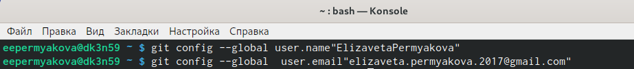{ #fig:002 width=70% }

После этого создаём новый ключ на github и привязываем его к копьютеру через консоль.(рис. -@fig:003) 

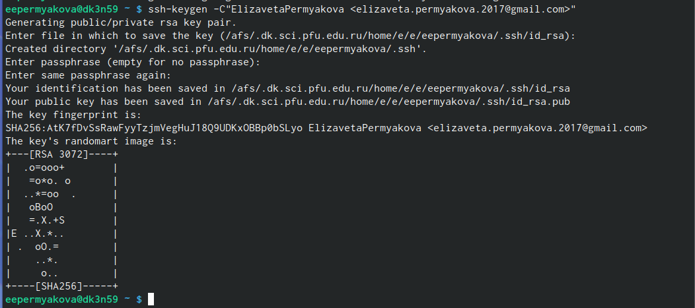{ #fig:003 width=70% }

Следующим шагом будет создание и подключение репозитория к github. В gethup заходим в «repository» и создаём новый репозиторий (имя «laboratory», а заголовок для файла README). Копируем в консоль ссылку на репозиторий (для дальнейшей работы с файлами).(рис. -@fig:004)

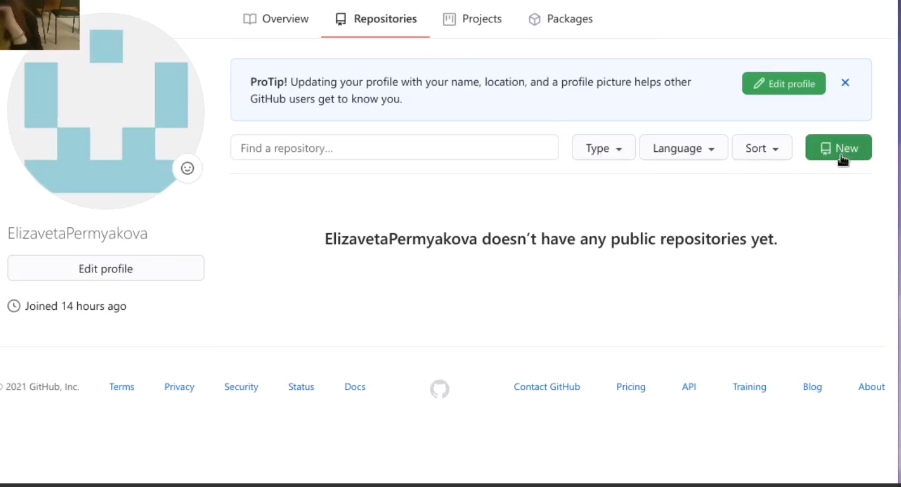{ #fig:004 width=70% }

(рис. -@fig:005)

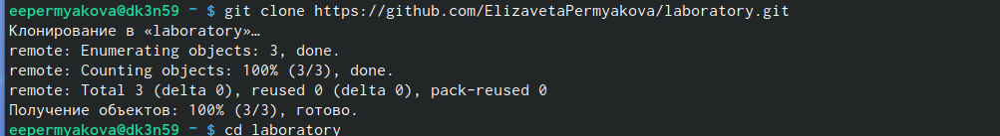{ #fig:005 width=70% }

В лабораторной работе описан логаритм создания структуры католога через консоль. Но легче будет создать репозиторий в gethup и после этого работать с каталогом и папками через консоль (перед этим необходимо скопировать ссылку на репозиторий в консоль, в формате https или ssh).  Перед тем, как создавать файлы, заходим в наш репозиорий:(рис. -@fig:006)

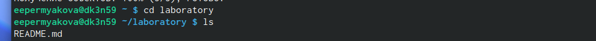{ #fig:006 width=70% }

После этого можем уже создавать наши файлы.(рис. -@fig:007)

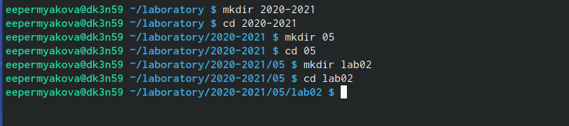{ #fig:007 width=70% }

Добавляем первый коммит и выкладываем на gethup. Для того, чтобы правильно разместить первый коммит, необходимо добавить команду git add ., после этого с помощью команды git commit -m "first commit" выкладываем коммит.(рис. -@fig:007)

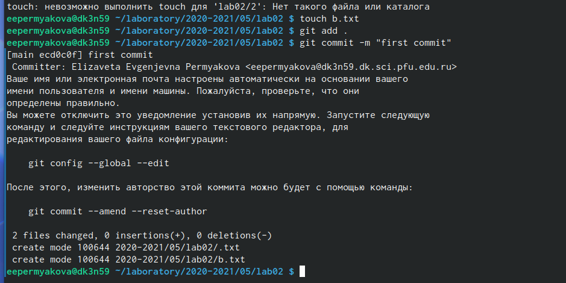{ #fig:008 width=70% }

Сохраняем первый коммит, используя команду git push.(рис. -@fig:009)

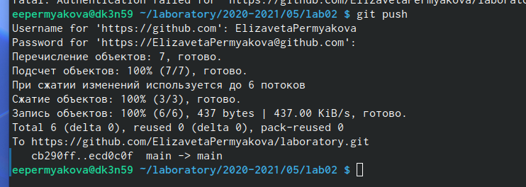{ #fig:009 width=70% }

Первичная конфигурация: 

1. Добавляем файл лицензии.(рис. -@fig:010)

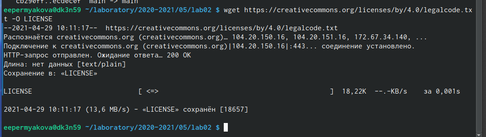{ #fig:010 width=70% }

2. Добавим шаблон игнорируемых файлов. Просмотрим список имеющихся шаблонов (на скриншоте список шаблонов представлен не в целом виде).(рис. -@fig:011)

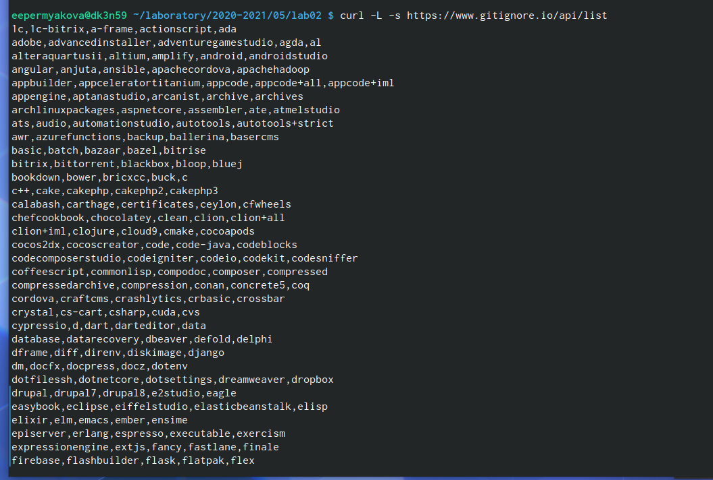{ #fig:011 width=70% }

3. Скачиваем шаблон, например, для C. Также добавляем новые файлы и выполняем коммит.(рис. -@fig:012)

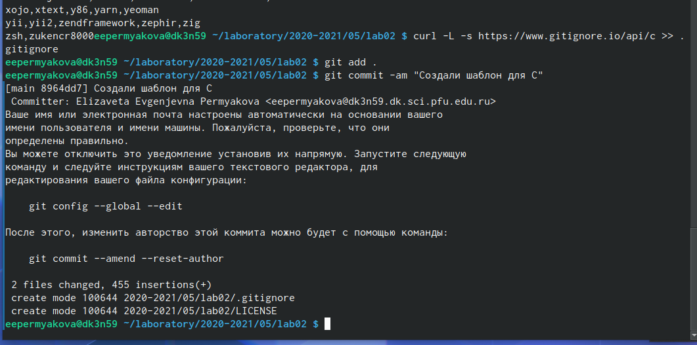{ #fig:012 width=70% }

4. Отправим на github (для этого сохраним все созданные шаблоны и файлы, используя команду git push).(рис. -@fig:013)

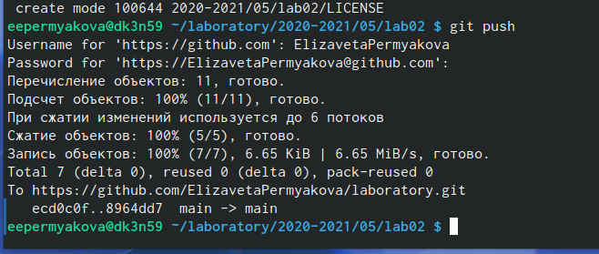{ #fig:013 width=70% }

Работаем с конфигурацией git-flow.

1. Инициализируем git-flow, используя команду git flow init -f (префикс для ярлыков установлен в v).(рис. -@fig:014)

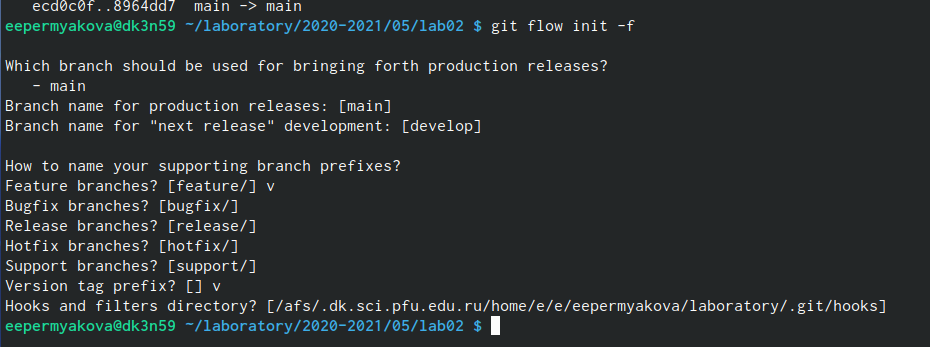{ #fig:014 width=70% }

2. Проверяем, что мы находимся на ветке develop (используем команду git branch).(рис. -@fig:015)

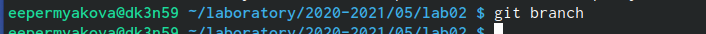{ #fig:015 width=70% }

(рис. -@fig:016)

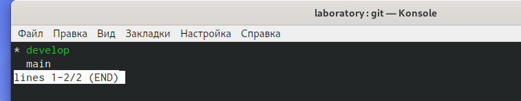{ #fig:016 width=70% }

3. Создаём релиз с версией 1.0.0.(рис. -@fig:017)

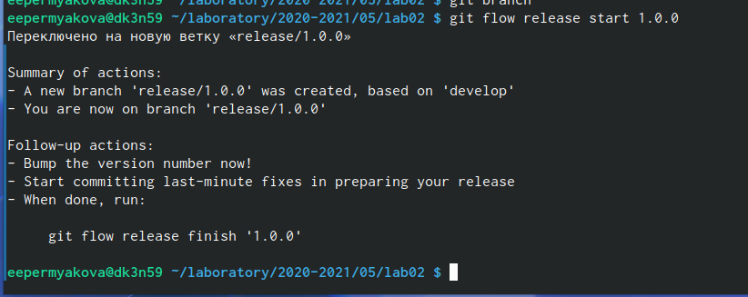{ #fig:017 width=70% }

4. Запишем версию и добавим в индекс.(рис. -@fig:018)

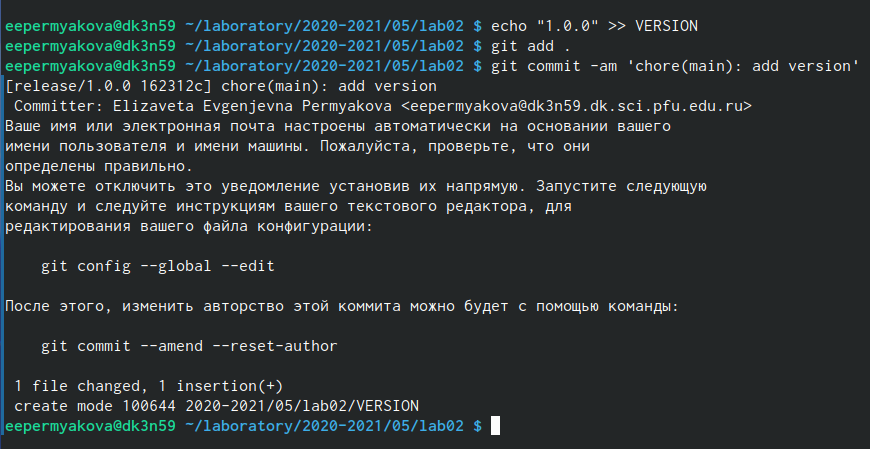{ #fig:018 width=70% }

5. Заливаем релизную ветку в основную ветку (используем команду git flow release finish1.0.0).(рис. -@fig:019)

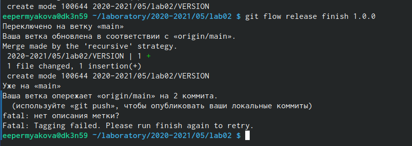{ #fig:019 width=70% }

6. Отправляем данные на github.(рис. -@fig:020)

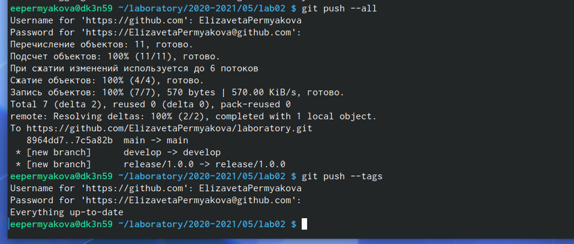{ #fig:020 width=70% }

Создаем релиз на github. Для этого заходим в «Releases», нажимаем «Создать новый релиз». Заходим в теги и заполняем все поля (создаём теги для версии 1.0.0). После создания тега, автоматически сформируется релиз.(рис. -@fig:021)

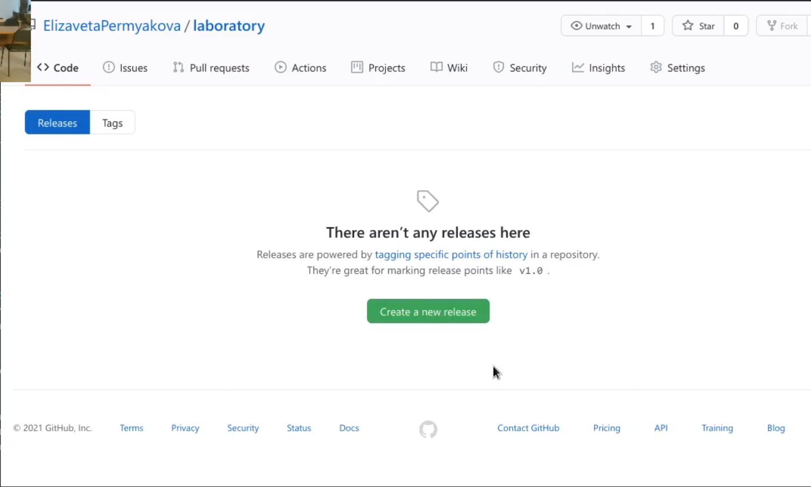{ #fig:021 width=70% }

(рис. -@fig:022)

{ #fig:022 width=70% }

(рис. -@fig:023)

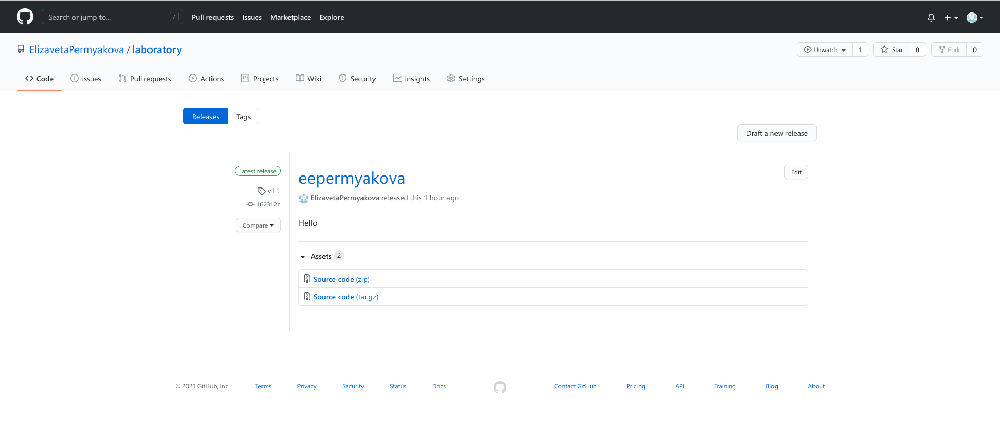{ #fig:023 width=70% }

# Выводы

Я изучила идеологию и научилась применять средства контроля версий. 
